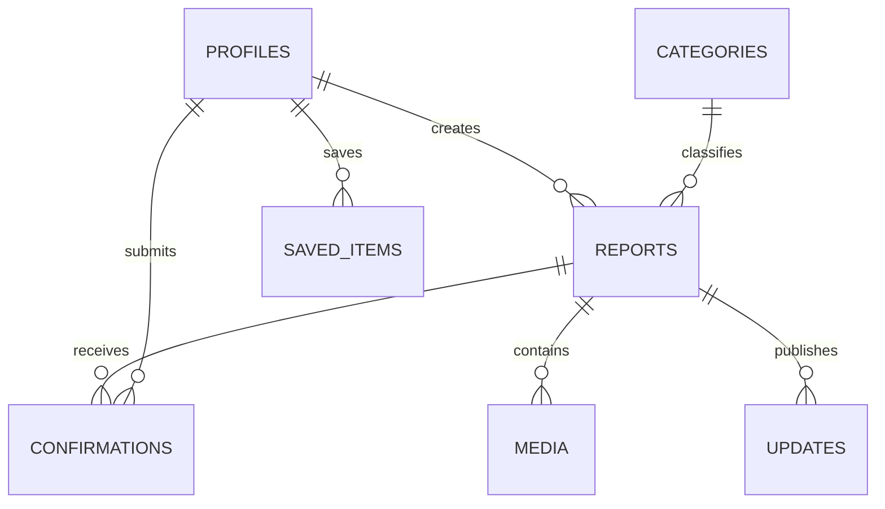
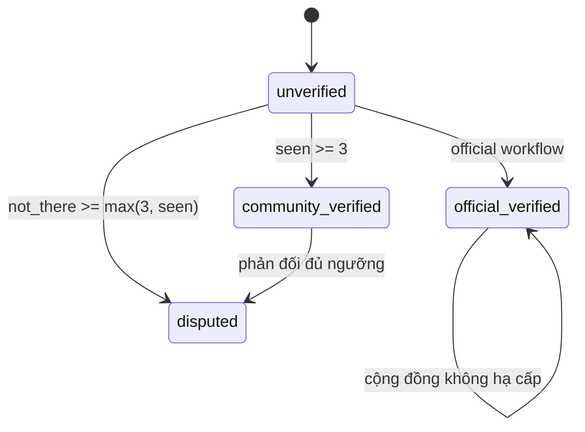

# Backend, dữ liệu và trust model

## Thành phần backend

- Supabase Auth quản lý session, Email OTP và Google OAuth; SMTP/OAuth secrets chỉ nằm server-side.
- PostgreSQL giữ dữ liệu ứng dụng.
- PostGIS lưu report geometry và followed-area polygons.
- RLS + grants xác định quyền table-level.
- Security-definer RPC đóng gói business invariants.
- Edge Functions là HTTP boundary cho authenticated write commands.

## Core data model

| Bảng                        | Mục đích                                              | Trạng thái sử dụng                                |
| --------------------------- | ----------------------------------------------------- | ------------------------------------------------- |
| `profiles`                  | Hồ sơ, trust level, contribution suspension           | Dùng bởi auth trigger và submit guard             |
| `user_roles`                | Member/trusted/official/moderator                     | Moderator helper đã có; workflow quản trị chưa có |
| `categories`                | Type, expiry và duplicate parameters                  | Dùng khi submit và map read                       |
| `official_sources`          | Nguồn chính thức                                      | Data foundation                                   |
| `reports`                   | Entity trung tâm, geometry, lifecycle và trust counts | Hoạt động                                         |
| `report_confirmations`      | Một vote hiện tại cho mỗi user/report                 | Hoạt động                                         |
| `report_media`              | Private upload, moderator claim và public publication | Photo vertical slice hoạt động                    |
| `report_comments`           | Bình luận có soft-hide                                | Foundation                                        |
| `report_status_history`     | Lịch sử đổi trạng thái                                | Hoạt động; trigger tự ghi                         |
| `report_updates`            | Timeline note/status/evidence đã publish              | Hoạt động qua public read + owner command         |
| `notification_outbox`       | Queue delivery server-only, retry bằng dedupe key     | Foundation                                        |
| `user_saved_items`          | Report/event user chủ động lưu và reminder            | Foundation                                        |
| `feature_rollouts`          | Server-owned rollout theo audience                    | Hoạt động; tất cả key mặc định tắt                |
| `followed_areas`            | Polygon và filter cảnh báo theo user                  | Foundation                                        |
| `push_devices`              | Expo push token theo user                             | Foundation                                        |
| `subscription_entitlements` | Server-owned mirror của Free/Plus entitlement         | Foundation; mobile read-own, billing chưa nối     |
| `moderation_cases`          | Hàng đợi và resolution kiểm duyệt report              | Hoạt động                                         |
| `report_moderation_actions` | Kết quả action idempotent, actor và private reason    | Hoạt động; moderator read-only                    |
| `audit_logs`                | Actor/action/entity metadata                          | Submit đang ghi audit log                         |

## Report lifecycle

Report có hai trục trạng thái độc lập:

- `verification_status`: độ tin cậy của thông tin.
- `operational_status`: report còn hiệu lực/đang theo dõi/đã kết thúc hay bị loại.

Operational values hiện có: `active`, `monitoring`, `resolving`, `resolved`, `expired`, `rejected`.
Trigger `reports_capture_status_history` tự ghi cả thay đổi verification và operational status. RPC
`expire_stale_reports` chuyển report quá `expires_at` sang `expired`; repo chưa cấu hình cron gọi RPC
này.

## Expiry và duplicate metadata

Mỗi category định nghĩa `default_expiry_minutes`, `duplicate_radius_meters` và `duplicate_window_minutes`. Submit RPC tính `expires_at` từ category; scheduled event dùng `ends_at`. Duplicate radius/window hiện mới là dữ liệu chuẩn bị cho scoring engine.

## Public privacy boundary

Public clients chỉ đọc:

- `get_map_items`: dữ liệu tối thiểu cho viewport/nearby, optional `distance_meters`, radius và
  category filter; không trả reporter identity.
- `public_report_details`: detail đã loại reporter identity, internal score và media chưa approved.

`anonymous_publicly` không xóa `created_by`. Đây là privacy presentation flag; backend vẫn giữ actor để thực thi suspension, idempotency, trust và moderation.

## RLS và grants

- `anon` và `authenticated` đọc enabled categories, public view và map RPC.
- Authenticated user đọc/sửa một phần profile của chính mình.
- User quản lý followed areas và push devices của chính mình.
- User chỉ đọc subscription entitlement của mình; mobile không được tự ghi tier/status.
- User chỉ đọc confirmations của chính mình.
- Moderator đọc moderation cases và audit logs.
- Report moderation queue không trả reporter/trust internals; approve/resolve/reject đi qua RPC
  caller-JWT và lưu immutable action result.
- Direct writes vào report/confirmation bị thu hồi; write path đi qua RPC được grant cụ thể.
- Timeline public read không lộ ownership; `can_update_report` chỉ trả boolean cho authenticated user.
- Add timeline update chỉ dành cho report creator/moderator và idempotent theo report/key.
- Member chỉ đọc metadata media do mình tạo; moderator queue được role-gate trước khi ký preview.
- Community upload dùng signed token vào bucket private. Approve claim ảnh trước, Edge Function
  copy object sang bucket public, service-role-only RPC finalize URL; reject không publish object.

Admin browser chỉ dùng anon key cùng moderator JWT. Service role chỉ tồn tại trong Edge Function;
không đưa `SUPABASE_SERVICE_ROLE_KEY` vào biến `NEXT_PUBLIC_*`, admin env hoặc mobile env.

## Database invariants quan trọng

- Scheduled event phải có `ends_at`.
- Coordinate được kiểm tra range trước khi tạo geometry.
- `(created_by, idempotency_key)` chống submit lặp.
- `(report_id, user_id)` đảm bảo mỗi user chỉ có một confirmation hiện tại.
- Report chỉ nhận confirmation khi đang `active` hoặc `monitoring`.
- Contribution bị chặn nếu profile đang suspended.
- Official verification không bị community recalculation hạ cấp.
- Media community chỉ là JPEG 1–1.600 px, 1–5 MB; tối đa ba row active/report và idempotent
  theo `(created_by, idempotency_key)`.
- `uploaded` chỉ nghĩa là đã nhận file private, không phải đã approved/public.
- Approve/reject idempotent theo moderator/key; claim active ngăn hai moderator publish đồng thời.
- Chỉ service-role finalizer được gắn public URL sau khi canonical object đã tồn tại.
- `moderator_verified` và `official_verified` là hai provenance khác nhau; community recalculation
  không được hạ cấp cả hai.
- Reject đổi lifecycle sang `rejected` nên public views tự loại report; resolve giữ detail/timeline.
