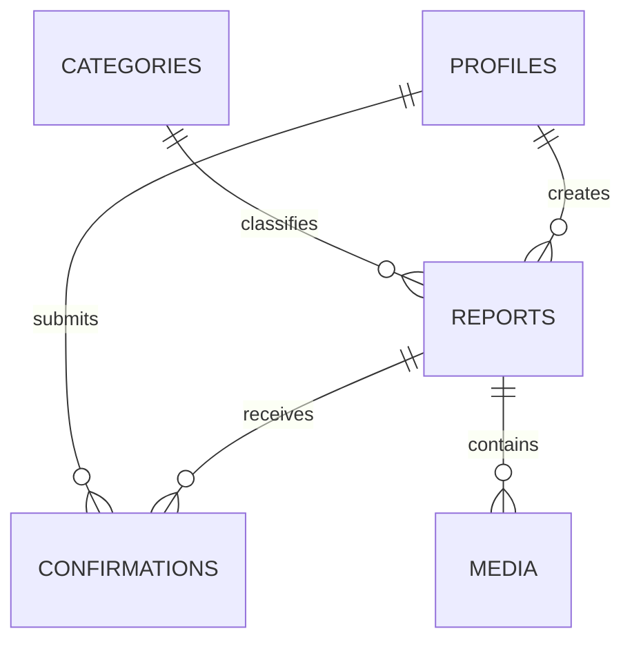
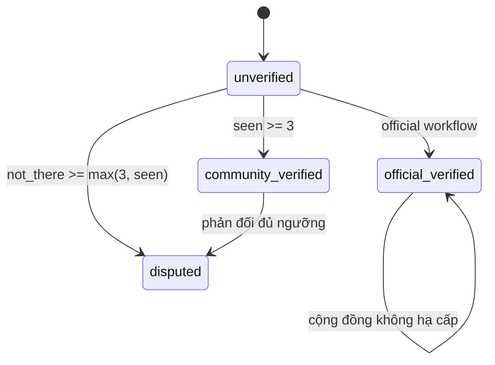

# Backend, dữ liệu và trust model

## Thành phần backend

- Supabase Auth quản lý session và Phone OTP.
- PostgreSQL giữ dữ liệu ứng dụng.
- PostGIS lưu report geometry và followed-area polygons.
- RLS + grants xác định quyền table-level.
- Security-definer RPC đóng gói business invariants.
- Edge Functions là HTTP boundary cho authenticated write commands.

## Core data model

| Bảng                    | Mục đích                                              | Trạng thái sử dụng                                |
| ----------------------- | ----------------------------------------------------- | ------------------------------------------------- |
| `profiles`              | Hồ sơ, trust level, contribution suspension           | Dùng bởi auth trigger và submit guard             |
| `user_roles`            | Member/trusted/official/moderator                     | Moderator helper đã có; workflow quản trị chưa có |
| `categories`            | Type, expiry và duplicate parameters                  | Dùng khi submit và map read                       |
| `official_sources`      | Nguồn chính thức                                      | Data foundation                                   |
| `reports`               | Entity trung tâm, geometry, lifecycle và trust counts | Hoạt động                                         |
| `report_confirmations`  | Một vote hiện tại cho mỗi user/report                 | Hoạt động                                         |
| `report_media`          | Metadata media và moderation status                   | Foundation                                        |
| `report_comments`       | Bình luận có soft-hide                                | Foundation                                        |
| `report_status_history` | Lịch sử đổi trạng thái                                | Foundation; chưa có trigger ghi tự động           |
| `followed_areas`        | Polygon và filter cảnh báo theo user                  | Foundation                                        |
| `push_devices`          | Expo push token theo user                             | Foundation                                        |
| `moderation_cases`      | Hàng đợi/case kiểm duyệt                              | Foundation                                        |
| `audit_logs`            | Actor/action/entity metadata                          | Submit đang ghi audit log                         |

## Report lifecycle

Report có hai trục trạng thái độc lập:

- `verification_status`: độ tin cậy của thông tin.
- `operational_status`: report còn hiệu lực/đang theo dõi/đã kết thúc hay bị loại.

Operational values hiện có: `active`, `monitoring`, `resolved`, `expired`, `rejected`. RPC `expire_stale_reports` chuyển report quá `expires_at` sang `expired`; repo chưa cấu hình cron gọi RPC này.

## Expiry và duplicate metadata

Mỗi category định nghĩa `default_expiry_minutes`, `duplicate_radius_meters` và `duplicate_window_minutes`. Submit RPC tính `expires_at` từ category; scheduled event dùng `ends_at`. Duplicate radius/window hiện mới là dữ liệu chuẩn bị cho scoring engine.

## Public privacy boundary

Public clients chỉ đọc:

- `get_map_items`: dữ liệu tối thiểu cho viewport.
- `public_report_details`: detail đã loại reporter identity, internal score và media chưa approved.

`anonymous_publicly` không xóa `created_by`. Đây là privacy presentation flag; backend vẫn giữ actor để thực thi suspension, idempotency, trust và moderation.

## RLS và grants

- `anon` và `authenticated` đọc enabled categories, public view và map RPC.
- Authenticated user đọc/sửa một phần profile của chính mình.
- User quản lý followed areas và push devices của chính mình.
- User chỉ đọc confirmations của chính mình.
- Moderator đọc moderation cases và audit logs.
- Direct writes vào report/confirmation bị thu hồi; write path đi qua RPC được grant cụ thể.

Service-role admin bỏ qua RLS và chỉ được tạo ở Next server module. Không đưa `SUPABASE_SERVICE_ROLE_KEY` vào biến `NEXT_PUBLIC_*` hoặc mobile env.

## Database invariants quan trọng

- Scheduled event phải có `ends_at`.
- Coordinate được kiểm tra range trước khi tạo geometry.
- `(created_by, idempotency_key)` chống submit lặp.
- `(report_id, user_id)` đảm bảo mỗi user chỉ có một confirmation hiện tại.
- Report chỉ nhận confirmation khi đang `active` hoặc `monitoring`.
- Contribution bị chặn nếu profile đang suspended.
- Official verification không bị community recalculation hạ cấp.
