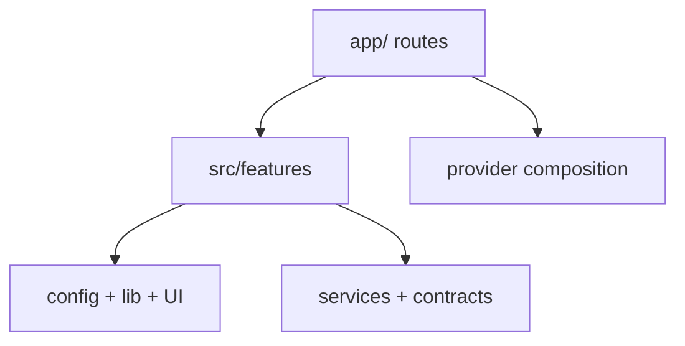

# Kiến trúc mobile

## Stack

- Expo SDK 57, React Native 0.86 và Expo Router.
- MapLibre React Native cho map, marker và clustering.
- TanStack Query cho server state.
- React Hook Form + Zod resolver cho form state/validation.
- Supabase JS cho auth, public reads và Edge Function invocation.
- Theme/token cục bộ qua `src/theme` và workspace `ui-tokens`.

MapLibre dùng native module, vì vậy app cần Expo development build; Expo Go không đủ.

## Layer và dependency direction

| Layer            | Có thể chứa                                               | Không nên chứa                             |
| ---------------- | --------------------------------------------------------- | ------------------------------------------ |
| `app/`           | Route params và render feature screen                     | JSX screen lớn, data access, business rule |
| `features/`      | `api/components/hooks/model/screens/lib` theo domain      | Global infrastructure không thuộc feature  |
| `components/ui/` | UI thực sự dùng chung                                     | Supabase calls hoặc routing decision       |
| `config/`        | Branding, map config và build-time environment            | React state và feature workflow            |
| `lib/`           | Geo, format, navigation helpers thuần và có capability rõ | Generic `utils/helpers/constants` bucket   |
| `mocks/`         | Demo fixtures dùng bởi nhiều feature                      | Production state hoặc secret               |
| `services/`      | Supabase client, query client, external instances         | Screen state                               |
| `providers/`     | Composition của provider toàn app                         | Feature provider hoặc server-state cache   |
| `theme/`         | Semantic color, spacing, radius                           | Hard-coded business state                  |

Mỗi feature chỉ tạo subfolder khi có file thực tế. Import nội bộ dùng relative path; route hoặc
feature khác chỉ đi qua public `index.ts`. Static option của feature nằm trong `model/*.config.ts`,
network schema nằm trong `packages/contracts`, còn design values nằm trong `theme`.

## Routing hiện tại

| Route            | Vai trò                            | Auth                              |
| ---------------- | ---------------------------------- | --------------------------------- |
| `/`              | Live map và report preview         | Public                            |
| `/auth`          | Request/verify email OTP           | Public                            |
| `/auth/callback` | Hoàn tất Google OAuth callback     | Public callback                   |
| `/account`       | Trạng thái guest/member và logout  | Public shell; data theo session   |
| `/signed-out`    | Logout success và lối về guest map | Public                            |
| `/report/new`    | Composer tạo report                | Auth gate từ entry point          |
| `/report/[id]`   | Chi tiết và confirmation actions   | Read public; action authenticated |

`useAuthGate` giữ return URL để người dùng quay lại intent ban đầu sau Email OTP hoặc Google OAuth.
`AuthProvider` lắng nghe custom-scheme callback và route `/auth/callback` xử lý trạng thái
processing/error. Route protection hiện được áp dụng ở action entry points, chưa có
middleware/router guard tổng quát.

## Data flow

- `features/map/hooks/useMapReports` và `features/reports/hooks/useReport` dùng stable query keys trong `features/reports/model/report-query-keys.ts`.
- `useSubmitReport` gọi feature service, sau đó route hiển thị feedback thành công.
- `useConfirmReport` gọi command và invalidates dữ liệu report tương ứng.
- `features/map/api/map-reports.service.ts` chuyển snake_case database rows thành camelCase domain objects.
- Khi Supabase client không được tạo, services trả demo data/delay mô phỏng.

## Map rendering

`CommunityReportsLayer` đổi report sang GeoJSON `FeatureCollection<Point>`. `GeoJSONSource` bật cluster với radius 44; hai layer tách cluster và report point. Point color phản ánh severity.

Location tracking chỉ chạy foreground sau khi người dùng bấm locate. App kiểm tra permission và
Location Services, dùng last-known location tối đa năm phút/độ chính xác 1 km để phản hồi nhanh,
sau đó lấy một current position với `Accuracy.High` trước khi theo dõi vị trí cân bằng mỗi 20 m hoặc
khoảng 10 giây. Camera follow có thể bật lại bằng nút locate và tự nhường quyền điều khiển khi người
dùng pan map. Tracking raw không được persist.

`useMapViewport` nhận bounds thật từ `Map.onRegionDidChange` sau khi camera dừng. Hook debounce 350 ms, làm tròn bốn
chữ số thập phân cho query key rồi gọi `get_map_items`; query key gồm bounds, zoom, category filter
và tâm tính distance. TanStack Query giữ dữ liệu cũ trong lúc refetch. Khi map chưa emit bounds đầu
tiên, service fallback về bounding box TP.HCM.

Map luôn fetch theo viewport. Nearby sheet dùng query riêng theo tâm GPS hoặc camera với ba bán kính
1/5/15 km; backend trả `distance_meters` và ưu tiên severity, distance, freshness, verification.
Category chips truyền filter xuống cả hai query. Khi user pan khỏi GPS, camera mode chuyển từ “Quanh
tôi” sang “Khu vực trên bản đồ”.

Recent areas chỉ được ghi sau thao tác pan/zoom của người dùng, không ghi từ camera follow GPS. Mỗi
record chỉ chứa tên coarse, center làm tròn 0,01°, zoom làm tròn 0,5 và trạng thái pin; tối đa tám
record trong SecureStore của thiết bị. Không có timestamp, polyline, raw GPS hay lịch sử di chuyển.
Guest/member hiện cùng dùng local store; member sync sẽ đi cùng followed-areas workflow sau này.

Giới hạn hiện tại:

- Camera mặc định ở khu vực thí điểm TP.HCM.
- Cluster tap chưa zoom/explode cluster.
- Search text chưa nối query hoặc deep-link; category chips đã nối server filter.
- Reverse geocode phụ thuộc dịch vụ của thiết bị và fallback về chuỗi tọa độ khi không có địa chỉ.

## Form và mutation

`SubmitReportInput` được kiểm tra bằng `submitReportInputSchema`. Title dài 6–120 ký tự, description 12–1200, coordinate phải hợp lệ và scheduled event bắt buộc `endsAt`. Mỗi submission tạo UUID làm idempotency key.

Composer bắt buộc người dùng xác nhận location picker trước khi submit. Nếu chưa có lựa chọn cũ,
picker thử dùng foreground GPS làm điểm khởi tạo; denied/blocked vẫn cho kéo pin thủ công. GPS có
accuracy lớn hơn 100 m không được xác nhận cho tới khi người dùng chỉnh pin. Reverse geocode chạy
best-effort; chỉ coordinate/address đã xác nhận đi vào `SubmitReportInput`, không fallback âm thầm về
center TP.HCM. Route adapter chỉ render `NewReportScreen`, còn auth gate được kiểm tra lại tại thời
điểm submit để bảo vệ cả deep link trực tiếp.

Composer vẫn hard-code ba category seed IDs. Khi category trở thành dữ liệu động, UI phải fetch
categories thay vì giữ UUID trong source.

## Quy tắc utility và constant

- Không tạo `src/utils`, `src/helpers`, `utils.ts`, `helpers.ts` hoặc `constants.ts` cấp root.
- Pure function dùng bởi nhiều domain nằm trong capability cụ thể dưới `src/lib`.
- Logic chỉ thuộc một feature nằm trong `features/<feature>/lib`.
- Feature constants và static options nằm trong `features/<feature>/model/*.config.ts`.
- Branding/build/env nằm trong `src/config`; semantic design values nằm trong `src/theme`.
- Function có I/O được đặt tên `service`, `repository` hoặc `api`, không gọi là utility.

## Agent guidance trong source

`apps/mobile/src/AGENTS.md`, `src/skills` và `src/agents` là hướng dẫn cho coding agents, không được import vào runtime bundle. Registry hiện có mobile architect, community map và release guardian roles.
