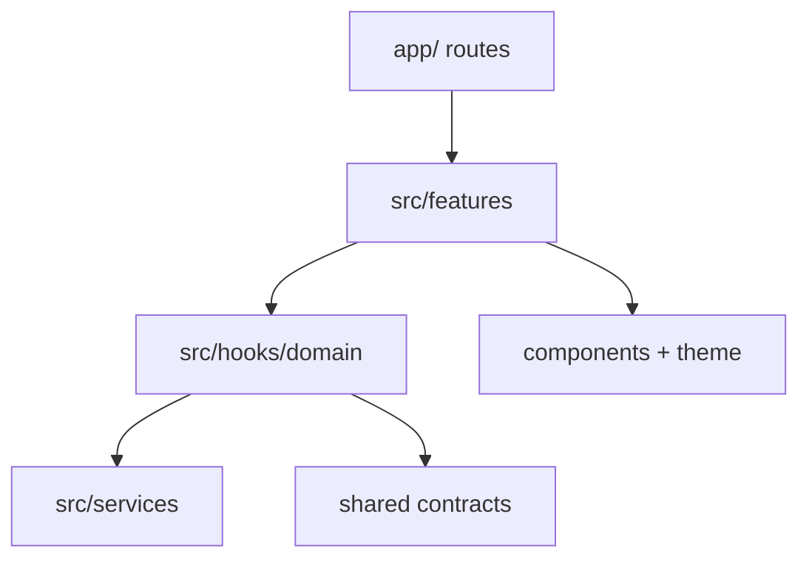

# Kiến trúc mobile

## Stack

- Expo SDK 57, React Native 0.86 và Expo Router.
- MapLibre React Native cho map, marker và clustering.
- TanStack Query cho server state.
- React Hook Form + Zod resolver cho form state/validation.
- Supabase JS cho auth, public reads và Edge Function invocation.
- Theme/token cục bộ qua `src/theme` và workspace `ui-tokens`.

MapLibre dùng native module, vì vậy app cần Expo development build; Expo Go không đủ.

## Layer và dependency direction

| Layer           | Có thể chứa                                           | Không nên chứa                                |
| --------------- | ----------------------------------------------------- | --------------------------------------------- |
| `app/`          | Route params, screen composition, navigation boundary | Data access lặp lại, business rule dùng chung |
| `features/`     | UI theo domain và feature-specific service            | Global infrastructure không thuộc feature     |
| `hooks/domain/` | Query/mutation hooks, cache keys, invalidation        | JSX lớn, native UI details                    |
| `services/`     | Supabase client, query client, external adapters      | Screen state                                  |
| `components/`   | UI tái sử dụng                                        | Supabase calls                                |
| `providers/`    | Auth/query/safe-area lifecycle                        | Domain command riêng lẻ                       |
| `theme/`        | Semantic color, spacing, radius                       | Hard-coded business state                     |

## Routing hiện tại

| Route          | Vai trò                          | Auth                              |
| -------------- | -------------------------------- | --------------------------------- |
| `/`            | Live map và report preview       | Public                            |
| `/auth`        | Request/verify phone OTP         | Public                            |
| `/report/new`  | Composer tạo report              | Auth gate từ entry point          |
| `/report/[id]` | Chi tiết và confirmation actions | Read public; action authenticated |

`useAuthGate` giữ return URL để người dùng quay lại intent ban đầu sau OTP. Route protection hiện được áp dụng ở action entry points, chưa có middleware/router guard tổng quát.

## Data flow

- `useMapReports` và `useReport` dùng stable query keys trong `query-keys.ts`.
- `useSubmitReport` gọi feature service, sau đó route hiển thị feedback thành công.
- `useConfirmReport` gọi command và invalidates dữ liệu report tương ứng.
- `map.service.ts` chuyển snake_case database rows thành camelCase domain objects.
- Khi Supabase client không được tạo, services trả demo data/delay mô phỏng.

## Map rendering

Report được đổi sang GeoJSON `FeatureCollection<Point>`. `GeoJSONSource` bật cluster với radius 44; hai layer tách cluster và report point. Point color phản ánh severity.

Giới hạn hiện tại:

- Camera mặc định ở khu vực thí điểm TP.HCM.
- Service query đang dùng bounding box cố định, chưa lắng nghe camera idle/bounds.
- Cluster tap chưa zoom/explode cluster.
- Search và filter chips chưa nối state/query.
- User location chỉ hiện sau permission; chưa recenter camera hoặc dùng làm report coordinate.

## Form và mutation

`SubmitReportInput` được kiểm tra bằng `submitReportInputSchema`. Title dài 6–120 ký tự, description 12–1200, coordinate phải hợp lệ và scheduled event bắt buộc `endsAt`. Mỗi submission tạo UUID làm idempotency key.

Composer hiện hard-code ba category seed IDs và một vị trí mẫu. Khi category trở thành dữ liệu động, UI phải fetch categories thay vì giữ UUID trong source.

## Agent guidance trong source

`apps/mobile/src/AGENTS.md`, `src/skills` và `src/agents` là hướng dẫn cho coding agents, không được import vào runtime bundle. Registry hiện có mobile architect, community map và release guardian roles.
