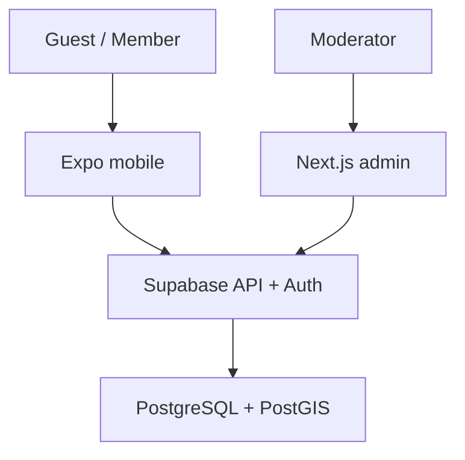
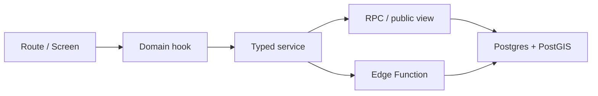

# Tổng quan kiến trúc

## System context

Mobile và admin không chia sẻ UI runtime. Chúng chia sẻ type/validation và design token qua workspace packages. Supabase là backend chính: authentication, Postgres/PostGIS, RLS, RPC và Edge Functions.

## Monorepo

| Path                  | Trách nhiệm                                                              |
| --------------------- | ------------------------------------------------------------------------ |
| `apps/mobile`         | Expo/React Native client, guest browse, auth gate và contribution flows. |
| `apps/admin`          | Next.js moderation dashboard chạy server-side.                           |
| `packages/contracts`  | Zod schemas và TypeScript types dùng chung.                              |
| `packages/ui-tokens`  | Token màu/kích thước có thể chia sẻ giữa clients.                        |
| `supabase/migrations` | Schema, indexes, RLS, grants, views và RPC.                              |
| `supabase/functions`  | HTTP boundary cho authenticated commands.                                |
| `supabase/tests`      | Smoke tests cho security invariants.                                     |

## Read path và command path

- **Public reads** dùng `get_map_items` và `public_report_details`. Hai boundary này cố ý loại reporter identity và internal trust score.
- **Authenticated commands** đi qua Edge Functions rồi tới security-definer RPC. JWT của người dùng được forward, nên `auth.uid()` vẫn là actor thật.
- **Admin reads** chạy server-side với `SUPABASE_SERVICE_ROLE_KEY`. Key này không được xuất hiện trong client bundle.

## Các quyết định kiến trúc

### Guest-first thay vì auth-first

Public discovery không đòi session. Điều này giảm friction và phù hợp với giá trị cốt lõi của live map. Authentication chỉ là boundary của hành vi tạo ảnh hưởng lên dữ liệu.

### PostGIS cho dữ liệu không gian

Report lưu `Geometry` SRID 4326; map query dùng GiST index và bounding envelope. Followed areas dùng polygon để chuẩn bị cho cảnh báo theo vùng.

### Contract-first ở ranh giới client

Form và domain types dùng `@trending-map/contracts`. Database vẫn là authority cuối cùng, nhưng shared Zod schemas giúp lỗi payload xuất hiện sớm ở client và test.

### Backend quyết định trust

Client không tự nâng trạng thái xác minh. Count và status được tính trong database để mọi client có cùng kết quả và tránh sửa state từ thiết bị.

### Demo mode là fallback phát triển

Mobile/admin có demo data khi thiếu env. Demo mode giúp dựng UI nhanh, nhưng không phải persistence, security test hay mô phỏng đầy đủ production.

## Quality boundaries

- Route files mỏng; logic dùng lại nằm trong `src`.
- Server state đi qua TanStack Query, không sao chép vào global store.
- Input mutation phải có idempotency key.
- Public payload không lộ `created_by`, phone, role hoặc `trust_score_internal`.
- Schema/policy thay đổi bằng migration; không sửa production trực tiếp.
