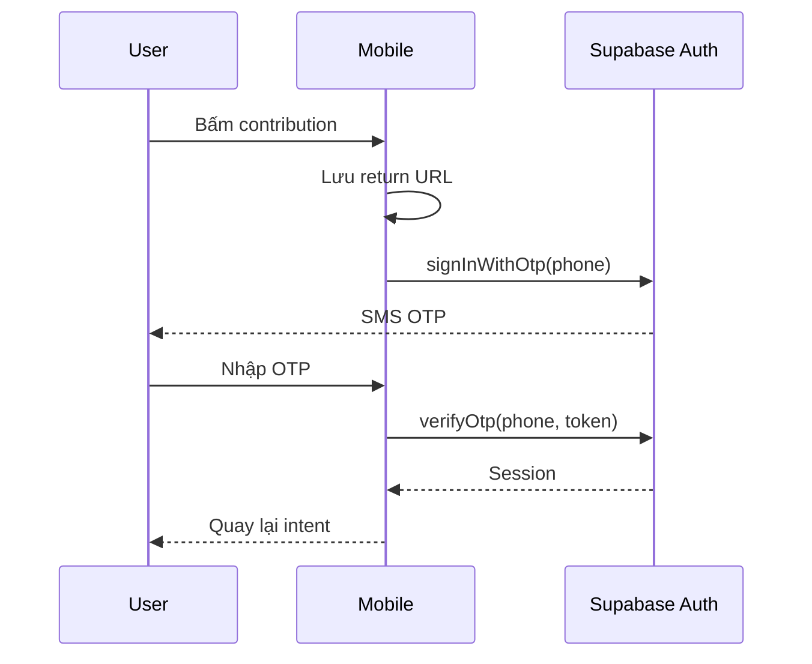

# Authentication và authorization

## Mô hình truy cập

| Hành vi                                      | Guest | Member                  | Moderator            |
| -------------------------------------------- | ----- | ----------------------- | -------------------- |
| Xem map/cluster                              | Có    | Có                      | Có                   |
| Xem public report detail                     | Có    | Có                      | Có                   |
| Xem enabled categories                       | Có    | Có                      | Có                   |
| Tạo report                                   | Không | Có, nếu không suspended | Có                   |
| Xác nhận report                              | Không | Có                      | Có                   |
| Quản lý followed areas/push devices của mình | Không | Có                      | Có                   |
| Đọc moderation cases/audit logs              | Không | Không                   | Có                   |
| Admin dashboard bằng service role            | Không | Không                   | Server-only operator |

## OTP flow

Trong demo mode, không có SMS: chuỗi đúng sáu chữ số tạo `demo-user` trong memory. Đây chỉ là developer convenience, không phải security implementation.

## Session lifecycle

`AuthProvider`:

1. Lấy session hiện tại khi Supabase client tồn tại.
2. Subscribe `onAuthStateChange` để đồng bộ user.
3. Expose `requestOtp`, `verifyOtp`, `signOut` và `demoMode`.
4. Chỉ đưa `id` và `phone` cần thiết vào app-level user model.

Auth gate hiển thị bottom sheet giải thích quyền guest trước khi chuyển sang OTP. Route `/account`
hiển thị trạng thái guest hoặc member. Logout yêu cầu xác nhận, gọi Supabase
`signOut`, xóa TanStack Query cache và chuyển sang `/signed-out`; người dùng vẫn có thể quay lại map
ở chế độ guest.

Supabase React Native client dùng SecureStore adapter cho session persistence. Không tự lưu access token trong Zustand/AsyncStorage hoặc log token.

## Public anonymity

“Ẩn tên công khai” có nghĩa:

- `created_by` vẫn là authenticated user trong `reports`.
- Public map/detail không trả `created_by` dù flag bật hay tắt.
- Moderator/backend có thể truy nguyên actor theo policy và operational need.
- UI hiện chưa hiển thị reporter attribution cho bất kỳ report nào.

Nếu sau này thêm public profile attribution, mọi query phải kiểm tra `anonymous_publicly` ở database boundary, không chỉ ẩn bằng component.

## Authorization boundary

Authentication trả lời “người dùng là ai”; authorization được thực thi bằng:

- RLS cho dữ liệu thuộc user và moderator reads.
- Explicit grants/revokes cho table, view và function.
- RPC validation cho suspension, active status, ownership/idempotency và category validity.
- Edge Function yêu cầu Authorization header và forward JWT tới Supabase.

Client-side auth gate chỉ phục vụ UX. Nó không phải security boundary; database vẫn phải từ chối anonymous hoặc unauthorized call.

## Việc cần hoàn thiện trước production

- Cấu hình SMS provider, rate limit và OTP abuse protection.
- Thêm admin authentication/role gate cho Next dashboard.
- Chuẩn hóa error codes thay vì trả raw database error message.
- Thêm CAPTCHA/device risk cho hành vi spam cao.
- Test refresh/logout/session expiry trên iOS và Android.
- Quy định retention và access audit cho reporter identity/location.
