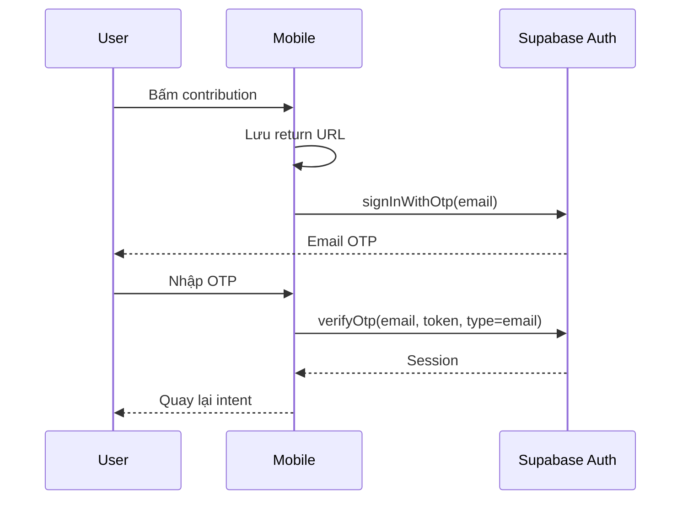
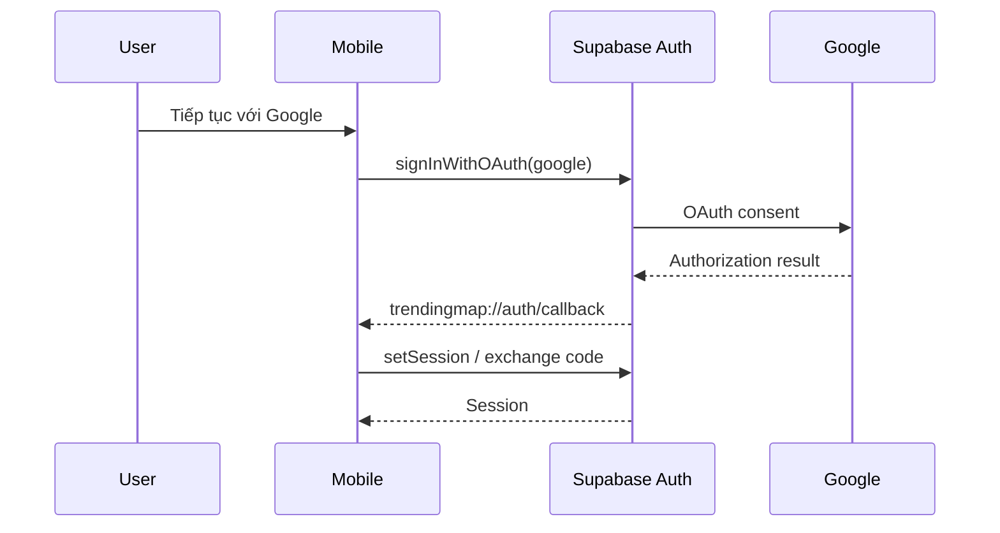

# Authentication và authorization

## Mô hình truy cập

| Hành vi                                      | Guest | Member                  | Moderator                    |
| -------------------------------------------- | ----- | ----------------------- | ---------------------------- |
| Xem map/cluster                              | Có    | Có                      | Có                           |
| Xem public report detail                     | Có    | Có                      | Có                           |
| Xem enabled categories                       | Có    | Có                      | Có                           |
| Tạo report                                   | Không | Có, nếu không suspended | Có                           |
| Xác nhận report                              | Không | Có                      | Có                           |
| Quản lý followed areas/push devices của mình | Không | Có                      | Có                           |
| Đọc subscription entitlement của mình        | Không | Có                      | Có                           |
| Ghi subscription entitlement                 | Không | Không                   | Trusted billing backend only |
| Đọc moderation cases/audit logs              | Không | Không                   | Có                           |
| Xem private media moderation queue           | Không | Không                   | Có, signed preview 10 phút   |
| Approve/reject media                         | Không | Không                   | Có, RPC kiểm tra role        |
| Approve/resolve/reject report                | Không | Không                   | Có, action retry-safe        |

Admin đăng nhập Email OTP bằng anon key. Role `moderator` trong `user_roles` là authorization
boundary thật; UI state không cấp quyền. Service role chỉ tồn tại trong Supabase Edge Function để
ký URL private và finalize publication, không nằm trong Next/browser env.

Moderator approve tạo provenance công khai `moderator_verified`, tách biệt
`official_verified` vốn chỉ dành cho nguồn chính thức. Resolution reason, actor và immutable action
row chỉ moderator đọc được; chúng không đi vào public report/timeline contract.

## OTP flow



Trong demo mode, không gửi email: chuỗi đúng sáu chữ số tạo `demo-user` trong memory. Đây chỉ là developer convenience, không phải security implementation.

## Google OAuth flow



Mobile dùng browser ngoài và custom scheme đã khai báo trong `app.json`. Callback route
`/auth/callback` giữ return URL, hoàn tất session rồi đưa người dùng về contribution intent. Callback
parser hỗ trợ cả implicit token và PKCE code. Client chủ động dùng PKCE để callback chỉ mang auth
code dùng một lần; session vẫn do Supabase lưu bằng SecureStore.

## Session lifecycle

`AuthProvider`:

1. Lấy session hiện tại khi Supabase client tồn tại.
2. Subscribe `onAuthStateChange` để đồng bộ user.
3. Expose Email OTP, Google OAuth, callback state, `signOut` và `demoMode`.
4. Chỉ đưa `id` và `email` cần thiết vào app-level user model.

Auth gate hiển thị bottom sheet giải thích quyền guest trước khi chuyển sang OTP. Route `/account`
hiển thị trạng thái guest hoặc member. Logout yêu cầu xác nhận, gọi Supabase
`signOut`, xóa TanStack Query cache và chuyển sang `/signed-out`; người dùng vẫn có thể quay lại map
ở chế độ guest.

Supabase React Native client dùng SecureStore adapter cho session persistence. Không tự lưu access token trong Zustand/AsyncStorage hoặc log token.

## Cấu hình Email OTP

Client không cần API key của dịch vụ gửi email. `EXPO_PUBLIC_SUPABASE_URL` và
`EXPO_PUBLIC_SUPABASE_ANON_KEY` là đủ; SMTP credential chỉ được cấu hình phía Supabase:

1. Trong Supabase Dashboard, bật Email provider ở **Authentication → Providers**.
2. Ở **Authentication → Emails → SMTP Settings**, dùng SMTP của Resend: host
   `smtp.resend.com`, port `465`, username `resend`, password là Resend API key và sender thuộc
   domain đã xác minh.
3. Ở **Authentication → Email Templates → Magic Link**, dùng nội dung tương đương
   `supabase/templates/magic-link.html`; template bắt buộc chứa `{{ .Token }}` để gửi mã sáu số
   thay vì link.
4. Giữ resend cooldown tối thiểu 60 giây và cấu hình rate limit/CAPTCHA trước public launch.

`supabase/config.toml` đã trỏ local Supabase vào email template trong repo. Hosted Supabase không
tự đọc file này sau khi deploy; cần đồng bộ template qua Dashboard hoặc Management API.

## Cấu hình Google OAuth

Không có Google secret hoặc client ID trong mobile `.env`. Supabase đứng giữa app và Google:

1. Tạo OAuth 2.0 Client ID loại **Web application** trong Google Cloud Console.
2. Authorized redirect URI của Google phải là callback lấy từ Supabase Dashboard, dạng
   `https://<project-ref>.supabase.co/auth/v1/callback`; không nhập custom scheme mobile vào Google.
3. Bật Google ở **Supabase → Authentication → Providers**, nhập Web Client ID và Client Secret.
4. Ở **Supabase → Authentication → URL Configuration**, thêm chính xác
   `trendingmap://auth/callback` vào Redirect URLs.
5. Tạo development build mới và test trên iOS/Android; Expo Go không bảo đảm custom OAuth scheme.

Local Supabase có thể bật provider bằng cấu hình sau; secret phải đến từ shell env và không commit:

```toml
[auth.external.google]
enabled = true
client_id = "<google-web-client-id>"
secret = "env(SUPABASE_AUTH_EXTERNAL_GOOGLE_CLIENT_SECRET)"
skip_nonce_check = false
```

Tham khảo [Supabase Google login](https://supabase.com/docs/guides/auth/social-login/auth-google),
[Supabase mobile deep linking](https://supabase.com/docs/guides/auth/native-mobile-deep-linking) và
[Expo authentication](https://docs.expo.dev/guides/authentication/).

## Public anonymity

“Ẩn tên công khai” có nghĩa:

- `created_by` vẫn là authenticated user trong `reports`.
- Public map/detail không trả `created_by` dù flag bật hay tắt.
- Moderator/backend có thể truy nguyên actor theo policy và operational need.
- UI hiện chưa hiển thị reporter attribution cho bất kỳ report nào.

Nếu sau này thêm public profile attribution, mọi query phải kiểm tra `anonymous_publicly` ở database boundary, không chỉ ẩn bằng component.

## Authorization boundary

Authentication trả lời “người dùng là ai”; authorization được thực thi bằng:

- RLS cho dữ liệu thuộc user và moderator reads.
- Explicit grants/revokes cho table, view và function.
- RPC validation cho suspension, active status, ownership/idempotency và category validity.
- Edge Function yêu cầu Authorization header và forward JWT tới Supabase.

Client-side auth gate chỉ phục vụ UX. Nó không phải security boundary; database vẫn phải từ chối anonymous hoặc unauthorized call.

## Việc cần hoàn thiện trước production

- Cấu hình custom SMTP, rate limit và Email OTP abuse protection.
- Xác minh sender domain; không đưa Resend API key vào mobile `.env.local`.
- Hoàn thiện Google consent screen, app branding và production publishing status.
- Thêm admin authentication/role gate cho Next dashboard.
- Chuẩn hóa error codes thay vì trả raw database error message.
- Thêm CAPTCHA/device risk cho hành vi spam cao.
- Test Google callback, refresh/logout/session expiry trên iOS và Android device thật.
- Quy định retention và access audit cho reporter identity/location.
